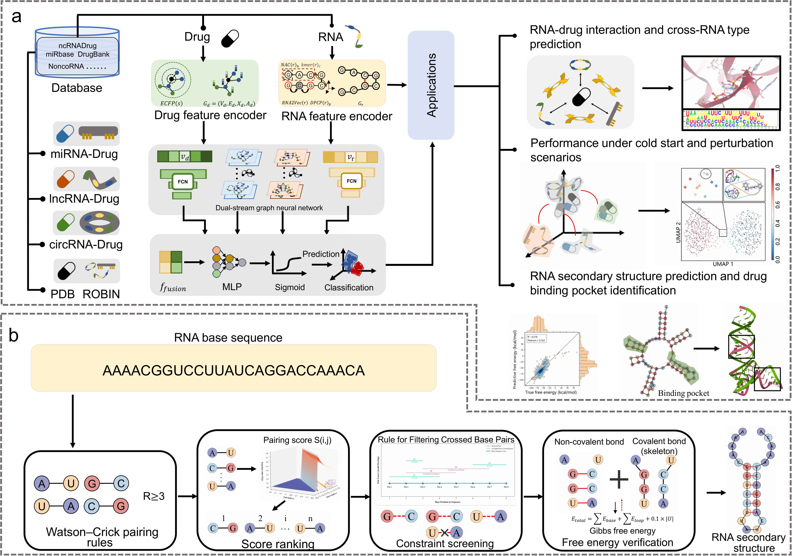

# GraphRDI: Dynamic RNA Structure Modeling for RNA–Drug Interaction Prediction

GraphRDI is a graph-based deep learning framework for predicting RNA–drug interactions (RDIs). It integrates dynamic RNA secondary-structure graph construction, drug molecular graph encoding, RNA sequence descriptors, drug fingerprints, and dual-stream graph attention networks to support RDI prediction across multiple RNA types and benchmark scenarios.


<p align="center">
  
</p>

<p align="center">
  <b>Figure 1.</b> Architectural overview of GraphRDI, including RNA/drug feature encoding, dynamic RNA secondary-structure graph construction, dual-stream graph fusion, and downstream RDI prediction and analysis tasks.
</p>

This repository is organized as a unified multi-scenario implementation. It supports:

- miRNA–drug interaction prediction
- lncRNA–drug interaction prediction
- circRNA–drug interaction prediction
- ROBIN-style pre-split benchmark training
- PDB-style pre-split benchmark training
- custom single-file datasets with random train/validation/test splitting
- custom pre-split train/validation/test datasets

---

## 1. Model overview

Given an RNA–drug pair, GraphRDI extracts multi-scale features from both molecules.

For RNA, the encoder uses:

- nucleic acid composition (NAC)
- 3-mer frequency features
- dinucleotide physicochemical property coding (DPCP)
- RNA2Vec embeddings
- dynamic RNA secondary-structure graphs

For drugs, the encoder uses:

- Extended Connectivity Fingerprints (ECFP)
- SMILES-derived molecular graphs
- atom-level molecular descriptors

The prediction module contains fully connected networks for vector features and graph attention networks (GATs) for RNA and drug graphs. Encoded features are concatenated and passed through a multilayer perceptron to output the RDI probability.

The RNA secondary-structure graph is constructed dynamically from the input sequence. Stable base pairs are screened using base-complementarity rules, sequence-distance constraints, non-crossing/non-overlapping constraints, and energy-related scoring. This avoids relying only on externally precomputed RNA structure files and provides a sequence-adaptive structural prior for RDI learning.

---

## 2. Repository structure

```text
GraphRDI/
├── main.py                         # Unified training entry point
├── model.py                        # FeatureProcessor, GAT/FCNN modules, GraphRDI model
├── feature_extraction.py           # Drug/RNA feature extraction, caching, RNA2Vec, data loading
├── RNA_2D.py                       # RNA secondary-structure graph construction
├── 1.png                      # GraphRDI framework figure shown in this README
├── configs/
│   ├── __init__.py
│   └── default_configs.py          # RNA-type and dataset preset configurations
├── data/                           # Put datasets here
├── feature_cache/                  # Automatically generated feature caches
├── saved_models/                   # Saved best checkpoints
├── results/                        # Metrics, plots, and final results
├── requirements.txt
└── README.md
```

---

## 3. Tested environment

The following environment was used for the current code check:

```text
OS: Ubuntu 20.04
Python: 3.8.10
PyTorch: 1.12.0+cu113
CUDA: 11.3
GPU: NVIDIA RTX 4090, 24 GB × 1
CPU: 16 vCPU Intel Xeon Platinum 8358P @ 2.60 GHz
Memory: 120 GB
System disk: 30 GB
Data disk: 50 GB
```

The environment check reported:

```text
torch==1.12.0+cu113
torch-geometric==2.6.1
rdkit==2024.3.5
numpy==1.24.4
pandas==2.0.3
scikit-learn==1.3.2
scipy==1.10.1
gensim==4.3.3
matplotlib==3.5.0
seaborn==0.13.2
networkx==3.1
tqdm==4.61.2
joblib==1.4.2
psutil==7.0.0
openpyxl==3.1.5
```

---

## 4. Installation

### 4.1 Create or activate your Python environment

Create a new environment with Python 3.8:

```bash
conda create -n graphrdi python=3.8 -y
conda activate graphrdi
```

### 4.2 Install dependencies

```bash
pip install -r requirements.txt
```

If you install from a clean environment and PyTorch is not found, install the CUDA 11.3 PyTorch wheel first:

```bash
pip install torch==1.12.0+cu113 torchvision==0.13.0+cu113 \
  --extra-index-url https://download.pytorch.org/whl/cu113
```

Then install the remaining dependencies:

```bash
pip install -r requirements.txt
```

### 4.3 Check the environment

```bash
python - <<'PY'
import torch
import torch_geometric
from torch_geometric.nn import GATConv, global_mean_pool
import rdkit
import pandas
import numpy

print('torch:', torch.__version__)
print('torch CUDA:', torch.version.cuda)
print('CUDA available:', torch.cuda.is_available())
print('torch_geometric:', torch_geometric.__version__)
print('GATConv import OK')
PY
```

---

## 5. Input data format

GraphRDI expects each sample to contain an RNA sequence, a drug SMILES string, and a binary interaction label.

Recommended column names:

```text
smiles,Sequence,interaction
```

The code also supports common aliases:

```text
smiles aliases:      smiles, sm_smiles, drug_smiles, Drug_SMILES, canonical_smiles
RNA sequence aliases: Sequence, sequence, rna_sequence, RNA_sequence, rna_seq, seq, RNA
label aliases:       interaction, label, Label, y, target, class, binding, bind
```

Labels should be binary:

```text
1 = interacting RNA–drug pair
0 = non-interacting RNA–drug pair
```

Both CSV and Excel files are supported for single-file random-split datasets. Pre-split benchmark mode expects CSV/Excel files for train, validation, and test sets.

---

## 6. Supported training modes

### 6.1 Single-file random split

Use this mode for miRNA, lncRNA, or circRNA datasets stored in a single labeled file. The code will randomly split the data according to the configuration.

#### miRNA

```bash
python main.py \
  --rna_type miRNA \
  --data_path data/miRNA_drug_interactions.csv
```

#### circRNA

```bash
python main.py \
  --rna_type circRNA \
  --data_path data/circRNA_drug_interactions.xlsx
```

#### lncRNA

```bash
python main.py \
  --rna_type lncRNA \
  --data_path data/lncRNA_drug_interactions.xlsx
```

### 6.2 Pre-split benchmark mode

Use this mode when train/validation/test files are already prepared, such as ROBIN, PDB, cold-start, perturbation, or external benchmark settings.

#### ROBIN net perturbation preset

Expected default paths:

```text
data/robin/netperturbation/data_train.csv
data/robin/netperturbation/data_val.csv
data/robin/netperturbation/data_test.csv
```

Run:

```bash
python main.py \
  --rna_type lncRNA \
  --preset robin_netperturbation
```

#### PDB preset

Expected default paths:

```text
data/pdb/data_train.csv
data/pdb/data_val.csv
data/pdb/data_test.csv
```

Run:

```bash
python main.py \
  --rna_type lncRNA \
  --preset pdb
```

#### Custom pre-split dataset

```bash
python main.py \
  --rna_type lncRNA \
  --split_mode presplit \
  --train_data_path data/custom/data_train.csv \
  --val_data_path data/custom/data_val.csv \
  --test_data_path data/custom/data_test.csv \
  --run_name custom_presplit
```

---

## 7. RNA graph construction modes

The unified implementation preserves different RNA graph settings for short and long RNA scenarios.

### miRNA mode

```text
rna_graph_mode = mirna
max_rna_nodes = 30
```

This mode follows the original short-RNA setting and is suitable for miRNA sequences.

### Long-RNA mode

```text
rna_graph_mode = long
max_rna_nodes = 400
```

This mode follows the long-RNA setting and is suitable for lncRNA, circRNA, ROBIN, and PDB-style benchmark scenarios. It uses long-sequence graph construction with caching and parallel feature extraction.

You can manually override the RNA graph mode:

```bash
python main.py --rna_type miRNA --rna_graph_mode mirna
python main.py --rna_type lncRNA --rna_graph_mode long
python main.py --rna_type circRNA --rna_graph_mode long
```

---

## 8. Important implementation notes

### 8.1 Feature cache

Feature extraction can be time-consuming, especially for long RNAs. The code automatically caches generated features in:

```text
feature_cache/
```

RNA graph caches are separated by graph mode, for example:

```text
rna_graph_mirna_cache.pkl
rna_graph_long_cache.pkl
```

If you change the RNA graph construction logic, data preprocessing rules, or important hyperparameters, clear the cache before rerunning:

```bash
rm -rf feature_cache/*
```

### 8.2 RNA2Vec in pre-split mode

For pre-split benchmark mode, RNA2Vec is trained on the training set and then reused for validation and test sets. This avoids training separate embedding spaces for different splits.

### 8.3 Balanced sampling

By default, the trainer applies class balancing to train, validation, and test datasets when both positive and negative samples exist. This behavior is controlled in `configs/default_configs.py`:

```python
enforce_balance = True
balance_train = True
balance_val = True
balance_test = True
```

---

## 9. Output files

After training, outputs are written to:

```text
saved_models/
results/
```

Typical output files include:

```text
saved_models/best_<run_name>.pt
results/loss_curve_<run_name>.png
results/confusion_matrix_<run_name>.png
results/metrics_<run_name>.csv
results/test_metrics_<run_name>.csv
```

The main evaluation metrics are:

- ACC
- Precision
- Recall
- F1 score
- ROC-AUC
- AUPR

---

## 10. Reproducing benchmark-style experiments

For ROBIN, PDB, cold-start, and perturbation experiments, prepare the corresponding train/validation/test files and use `--split_mode presplit` or a dataset preset.

For ten-fold cross-validation, prepare one directory per fold and run the trainer separately for each fold, for example:

```bash
for fold in 1 2 3 4 5 6 7 8 9 10; do
  python main.py \
    --rna_type lncRNA \
    --split_mode presplit \
    --train_data_path data/pdb/fold_${fold}/data_train.csv \
    --val_data_path data/pdb/fold_${fold}/data_val.csv \
    --test_data_path data/pdb/fold_${fold}/data_test.csv \
    --run_name PDB_fold_${fold}
done
```

Aggregate the resulting `test_metrics_*.csv` files to obtain mean and standard deviation.

---


## 11. Citation

If you use this code, please cite the GraphRDI manuscript:

```text
Dynamic RNA structure modeling enables accurate prediction of RNA-targeted small molecules

```

---

## 12. Contact

For questions about the method or implementation, please contact the corresponding author listed in the manuscript or open an issue in the project repository.
